# TL-HLD-001 — Taco Loco Order Flow & Abuse-Resistance Architecture

**Artifact type:** High-Level Design (HLD)  
**Method:** FALDEO Project Method v1.0 + Project Harness Minimum v1.0  
**Status:** `HUMAN_REVIEW / DESIGN_BASELINE`  
**Environment:** staging  
**Production:** `NOT_AUTHORIZED`  
**Scope:** customer order journey, verification, operational lifecycle, anti-abuse controls, observability and evolution path.

---

## 1. Executive summary

Taco Loco already proves the technical path `menu -> persisted order -> WhatsApp -> admin -> state transitions`, but the current flow has one material product risk: the system can persist a seemingly real order before it knows whether the customer actually sent the WhatsApp message or intends to buy.

The recommended high-level design separates **purchase intent** from **operational order admission**.

A click on **Continuar pedido** should mean:

> The system captured a valid purchase intent and generated a correlation reference.

It should not mean:

> Kitchen has a real order to prepare.

The recommended MVP control is therefore **manual WhatsApp verification before operational admission**, with expiration for abandoned intents and progressive controls for higher-risk cases.

### Architectural decision

Keep two independent lifecycle dimensions:

```text
verificationStatus = PENDING | VERIFIED | EXPIRED | REJECTED
orderStatus        = RECEIVED | CONFIRMED | IN_PREPARATION | READY | DELIVERED | CANCELLED
```

Only `VERIFIED` intents may enter the operational queue.

---

## 2. Engineering principles

1. **Intent is not operation.** A browser action is not sufficient evidence to start preparing food.
2. **Taco Loco is the system of record.** WhatsApp is a communication/verification channel, not the database.
3. **Risk controls are progressive.** Normal customers should face minimal friction; stronger controls activate only when justified.
4. **No silent destructive transitions.** Cancellation, rejection and operational state changes must remain auditable.
5. **Operational UX is primary.** The admin should behave like a foodtruck control console, not primarily like a CRUD.
6. **Evidence before complexity.** Payment automation, WhatsApp API and stronger fraud controls are introduced only when measured need justifies them.
7. **Production remains a separate Human Gate.** This HLD does not authorize implementation or release.

---

## 3. System context — C4-lite

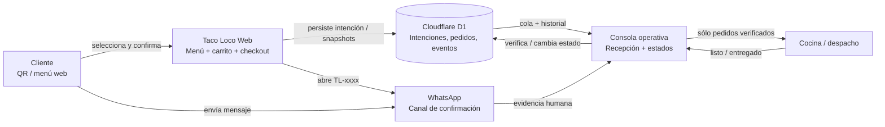

### Boundary rules

- The browser cannot directly place work into kitchen.
- WhatsApp confirmation is evidence of intent, not the system of record.
- The operator controls admission to the operational lifecycle.
- D1 preserves intent/order/event history.
- Production resources are outside the scope of this document.

---

## 4. Baseline currently proven in staging

The current staging environment already proves:

- public menu with 7 categories and 31 canonical products;
- prices, modifiers and static product media;
- server-side order persistence;
- `clientReference` idempotency;
- `TL-xxxx` numbering;
- order lines and snapshots;
- operational state transitions;
- `OrderEvent` history and SSE replay;
- admin authentication/session/logout;
- WhatsApp handoff with the correct Taco Loco number;
- staging operator review flow.

### Current operational state model

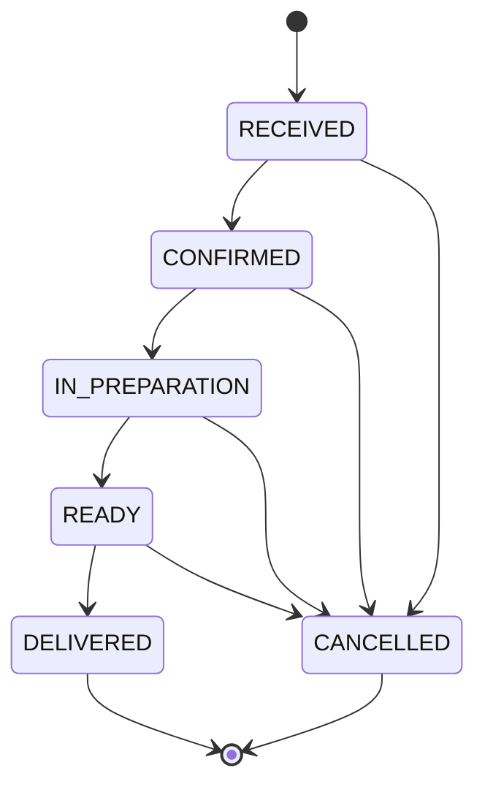

### Current material gap

The order may be persisted before the customer actually sends WhatsApp. Therefore an abandoned or intentionally false browser action can currently look too similar to a genuine order.

---

## 5. Target business flow

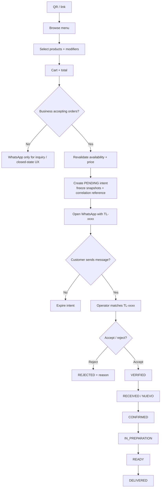

### Design intent

The system should allow abandoned intents to exist briefly without polluting kitchen operations. The operational board starts only after verification.

---

## 6. Swimlane / responsibility model

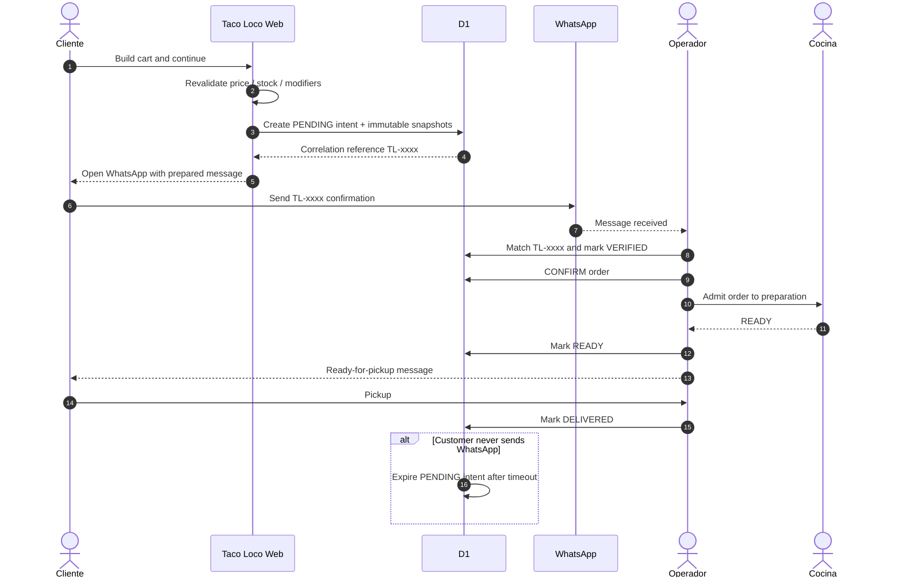

### Responsibility boundary

| Actor | Owns | Must not own |
|---|---|---|
| Customer | selection, explicit confirmation action | operational state |
| Web | validation, snapshots, intent creation, handoff | deciding that a customer is genuine |
| WhatsApp | communication evidence | canonical order data |
| Operator | verification, acceptance, state changes | silent data deletion |
| Kitchen | preparation execution | identity/verification logic |
| D1 | durable truth, history, correlation | human business judgment |

---

## 7. Recommended state architecture

### Verification lifecycle

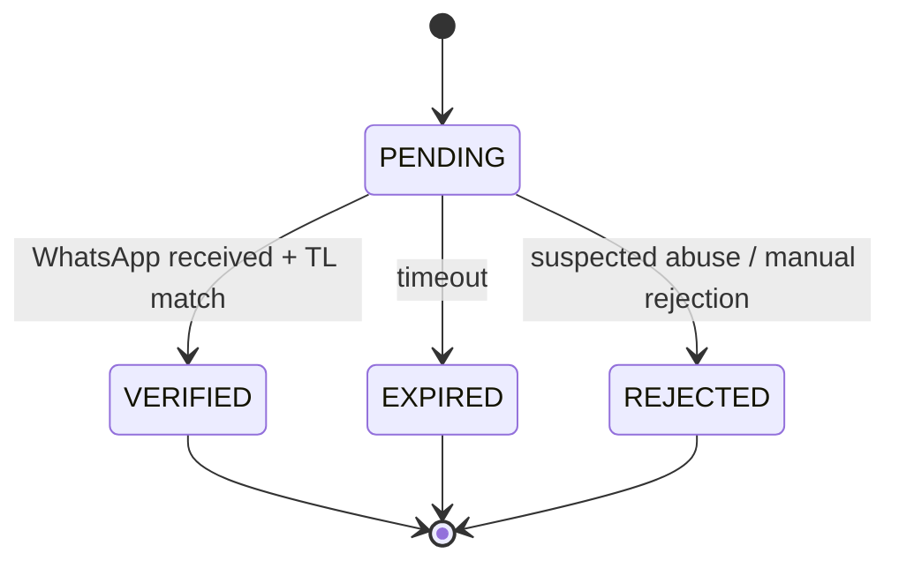

### Operational lifecycle

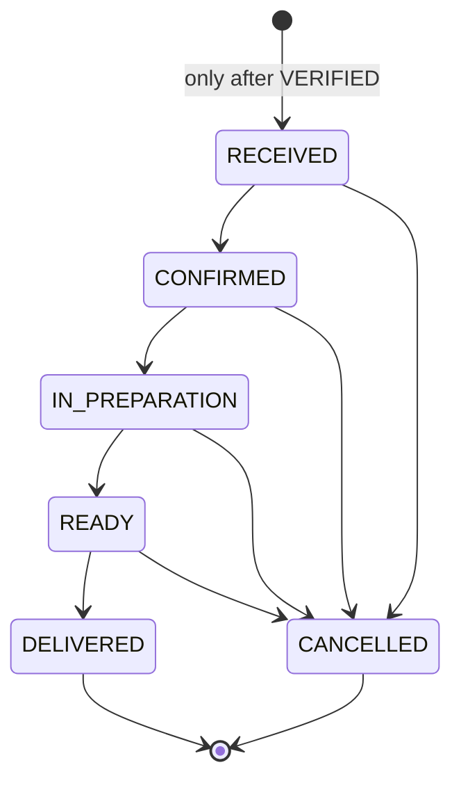

### Why two dimensions

Using one giant state machine would mix commercial verification, anti-abuse logic and kitchen operations. Separate dimensions keep the model understandable and allow future payment verification without destabilizing the operational lifecycle.

---

## 8. High-level information model

The following is a logical model, not yet an implementation contract.

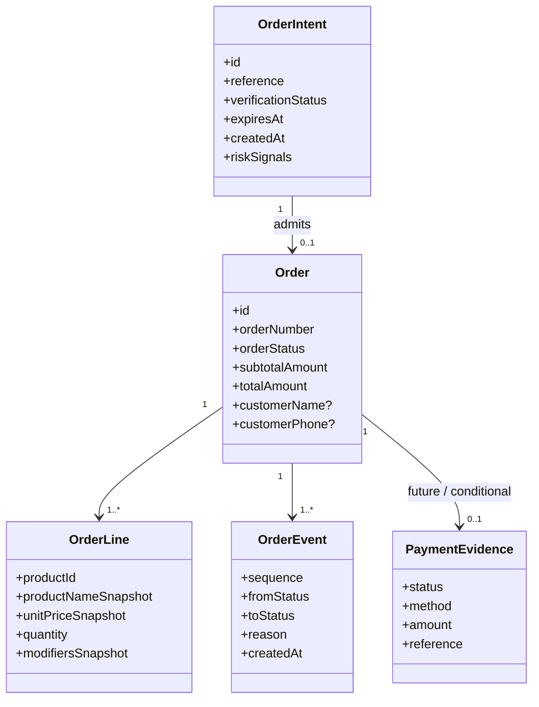

### Key modeling rule

A future implementation may choose a separate `OrderIntent` entity or an equivalent normalized structure, but it must preserve the semantic boundary **PENDING intent != operational order**.

---

## 9. Abuse / false-order threat model

| Threat | Example | Business impact | MVP control | Future escalation |
|---|---|---:|---|---|
| Accidental duplicate | double tap / retry | low | idempotency | none if metrics healthy |
| Normal abandonment | customer opens WhatsApp but never sends | low | PENDING + expiry | UX tuning |
| Joke/fake order | person intentionally submits without buying | medium | WhatsApp verification before kitchen | risk history / payment rule |
| Automated spam | bot creates many intents | medium/high | rate limit + expiry | distributed rate limit / challenge |
| High-value fake order | large order with no pickup | high | manual review | deposit / prepayment |
| Repeat no-show | same customer repeatedly does not collect | high | cancellation reason + history | deposit / denylist policy |
| Forged phone entry | fake number entered manually | medium | do not treat typed phone as proof | verified channel / API integration |

### Important distinction

**Anti-spam is not identity verification.** The current public rate limiter is a useful soft control, but because it is process-local/in-memory it must not be treated as durable distributed abuse protection or proof of customer intent.

---

## 10. Defense-in-depth model

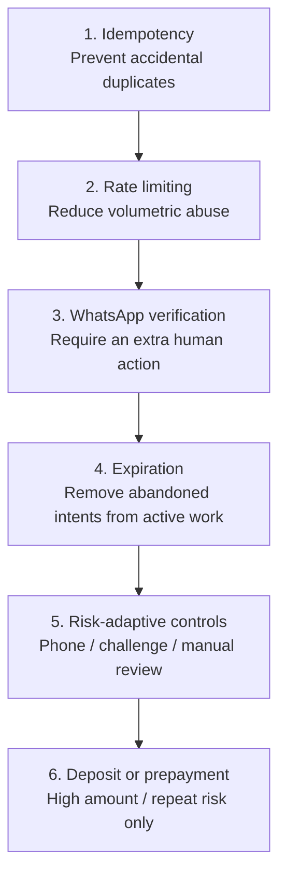

### Policy principle

Do not impose the strongest control on every customer. The control level should increase with observed risk and order value.

---

## 11. Risk-adaptive policy

### Normal risk

```text
Cart -> PENDING -> WhatsApp -> VERIFIED -> operational queue
```

No mandatory prepayment.

### Medium risk

Possible signals:

- several recent abandoned intents;
- repeated requests from the same source;
- unusually large basket;
- previous no-show;
- suspicious request frequency.

Response:

- explicit operator review;
- optional phone capture/validation;
- do not enter preparation immediately;
- optionally request deposit.

### High risk

Possible signals:

- exceptional amount;
- repeat no-show behavior;
- obvious automation;
- coordinated repeated fake attempts.

Response:

- mandatory deposit or full payment;
- manual rejection;
- temporary abuse block;
- stronger challenge if automation is proven.

---

## 12. Operational console — target UX model

The primary admin surface should become a control board rather than a product CRUD.

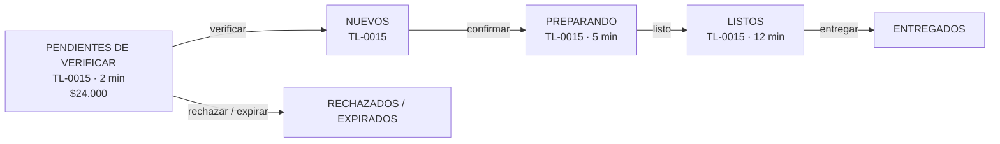

Each card should expose at minimum:

- `TL-xxxx` reference;
- age since intent/order creation;
- key products/modifiers;
- total;
- verification state;
- operational state;
- one-touch next action;
- exception/reason when blocked.

Catalog/settings remain secondary navigation.

---

## 13. Exception flows

| Scenario | Expected behavior | Classification |
|---|---|---|
| Business closed | prevent operational intent; allow inquiry UX | normal business rule |
| Product becomes unavailable during checkout | revalidate before intent persistence | recoverable conflict |
| WhatsApp app does not open | preserve PENDING intent and provide fallback | UX fallback |
| WhatsApp arrives after expiry | operator may reactivate if still valid | manual exception |
| Customer changes confirmed order | record explicit change/history | auditable mutation |
| Customer cancels | CANCELLED + reason + event | operational exception |
| Customer does not collect | close with specific no-show reason | risk evidence |
| Suspicious fake attempt | REJECTED + reason; never send to kitchen | abuse handling |

---

## 14. Payment evolution

Payment is an optional future verification dimension, not a prerequisite for the first improved flow.

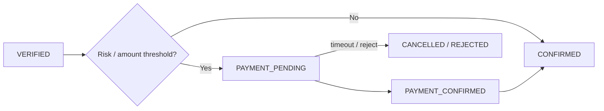

Initial implementation may use transfer/alias with manual confirmation. API automation should be justified by volume or operational burden.

---

## 15. WhatsApp role and message contract

WhatsApp should remain a **human communication channel**, while Taco Loco keeps canonical data.

Minimum initial message:

```text
Hola Taco Loco, quiero confirmar el pedido TL-0012.

2 x Taco x2 común — Salsa: Guacamole
1 x Gaseosa 1,5 L

Total: $25.000

Envío este mensaje para confirmar mi pedido.
```

Ready-for-pickup message:

```text
Tu pedido TL-0012 está listo para retirar.
```

Future WhatsApp Business API/webhooks may automate matching and outbound status notifications, but are not required for the MVP verification architecture.

---

## 16. Metrics and observability

The design should make these metrics derivable without reconstructing them from logs:

| Metric | Why it matters |
|---|---|
| intents created | demand / funnel entry |
| verified intents | genuine contact rate |
| expired intents | abandonment rate |
| rejected intents | abuse/manual rejection rate |
| intent -> verified time | verification friction |
| verified -> confirmed time | operator response |
| confirmed -> ready time | kitchen cycle time |
| ready -> delivered time | pickup delay |
| cancellation reason distribution | operational losses |
| no-show count/rate | strongest business-risk signal |
| average order amount | economics / risk threshold |
| manual intervention rate | automation opportunity |

No stronger anti-fraud mechanism should be introduced without evidence from these metrics unless an immediate material incident requires it.

---

## 17. Decision register

| ID | Decision | Status |
|---|---|---|
| D-001 | Separate verification lifecycle from operational lifecycle | **RECOMMENDED** |
| D-002 | WhatsApp manual verification is sufficient for MVP | **RECOMMENDED** |
| D-003 | Keep customer phone optional initially | **RECOMMENDED** |
| D-004 | Use expiry for non-verified intents | **RECOMMENDED** |
| D-005 | Start with ~10–15 min expiry window | **HYPOTHESIS / VALIDATE** |
| D-006 | Deposit/payment only by amount/risk, not globally | **RECOMMENDED** |
| D-007 | Admin becomes an operational board | **RECOMMENDED** |
| D-008 | Exact correlation/reference numbering semantics | **OPEN** |
| D-009 | Exact risk thresholds / no-show policy | **OPEN** |
| D-010 | WhatsApp API automation | **DEFERRED** |

---

## 18. Delivery roadmap and gates

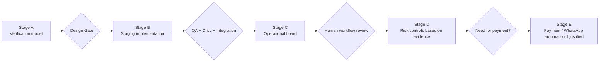

### Stage A — verification architecture

- define intent semantics;
- choose reference strategy;
- define expiry/rejection rules;
- define operator verification UX;
- define evidence/metrics.

### Stage B — bounded staging implementation

- data model / service changes;
- pending-verification queue;
- expiry handling;
- WhatsApp matching workflow;
- regression and abuse-path QA.

### Stage C — operational console

- Nuevos / Preparando / Listos;
- order age and SLA cues;
- one-touch transitions;
- exception reasons;
- mobile/tablet usability.

### Stage D — evidence-driven abuse controls

- strengthen rate limiting only if needed;
- no-show history;
- suspicious-pattern review;
- risk rules.

### Stage E — conditional automation

- deposit/payment workflow;
- WhatsApp API/webhooks;
- automatic matching/status messaging.

---

## 19. Acceptance criteria for a future implementation contract

A future implementation should not be considered complete until staging proves:

- PENDING intents do not enter the kitchen queue;
- WhatsApp/TL correlation can be verified reliably by the operator;
- unverified intents expire cleanly;
- duplicate browser retries remain idempotent;
- rejection and cancellation reasons remain auditable;
- verified orders preserve the existing state/event guarantees;
- the operational board separates verification from preparation;
- existing catalog/order functionality does not regress;
- metrics can distinguish abandonment, rejection, cancellation and no-show;
- abuse controls do not block a normal customer journey;
- production remains blocked until a separate Human Gate.

---

## 20. Open questions for Human Review

1. Should the visible `TL-xxxx` be assigned at intent creation even if some numbers later expire?
2. Should pending intents live on the same admin screen or in a dedicated verification inbox?
3. Is 10–15 minutes the right initial expiry window for this foodtruck operation?
4. Should customer name be requested before WhatsApp?
5. Under what evidence should phone capture become mandatory?
6. What amount should trigger optional/mandatory deposit?
7. How many no-shows should escalate a customer to higher risk?
8. What should the operator see when a previously expired TL reference arrives late?
9. Which flow should be optimized first: customer friction, operator speed, or fake-order resistance?

---

## 21. Authorization boundary

This HLD is a **design baseline for Human Review**. It does not authorize:

- production provisioning;
- production deployment or cutover;
- payment integration;
- WhatsApp Business API integration;
- stronger identity collection;
- irreversible schema changes.

All implementation must begin in staging under a bounded Task Contract and follow the normal FALDEO assurance path.

**Production remains `NOT_AUTHORIZED`.**
