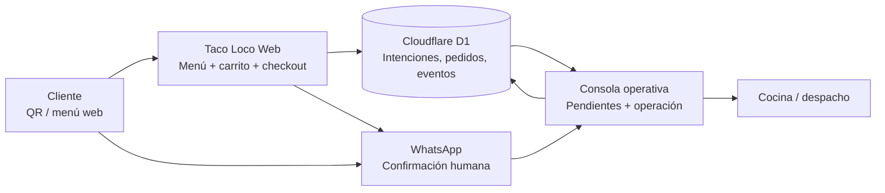
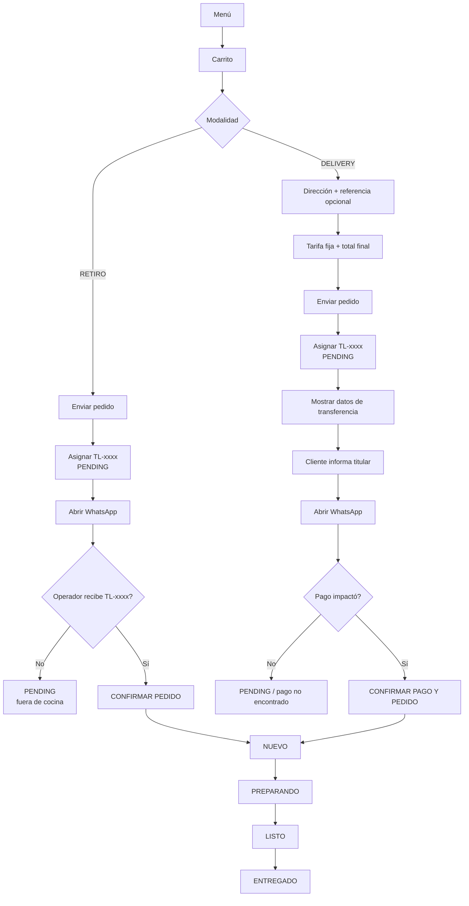
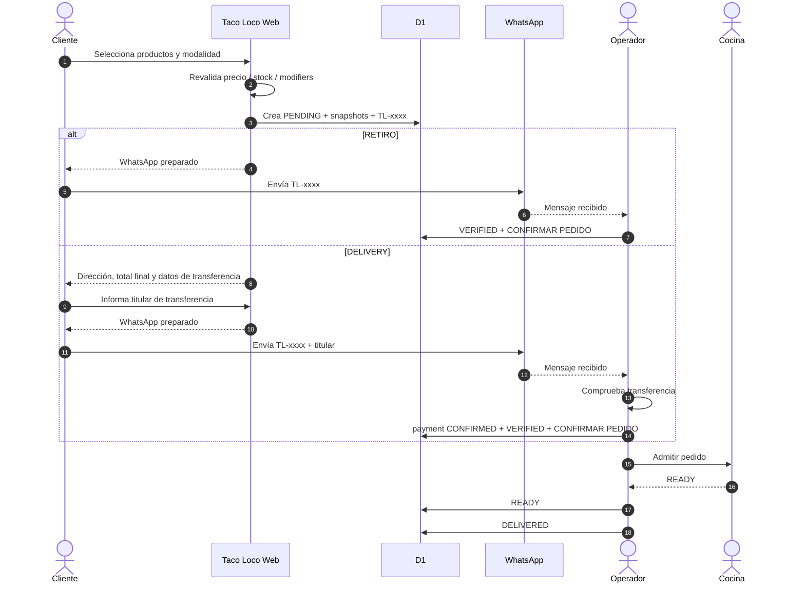
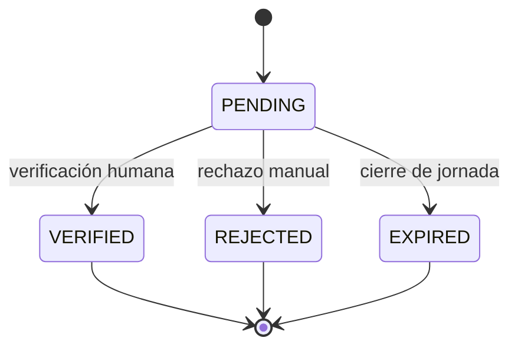
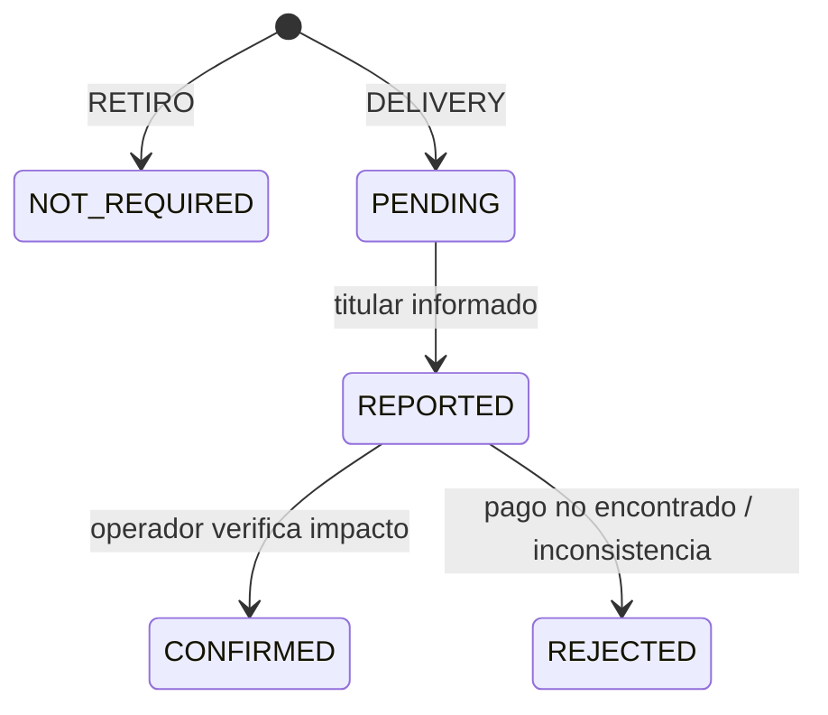
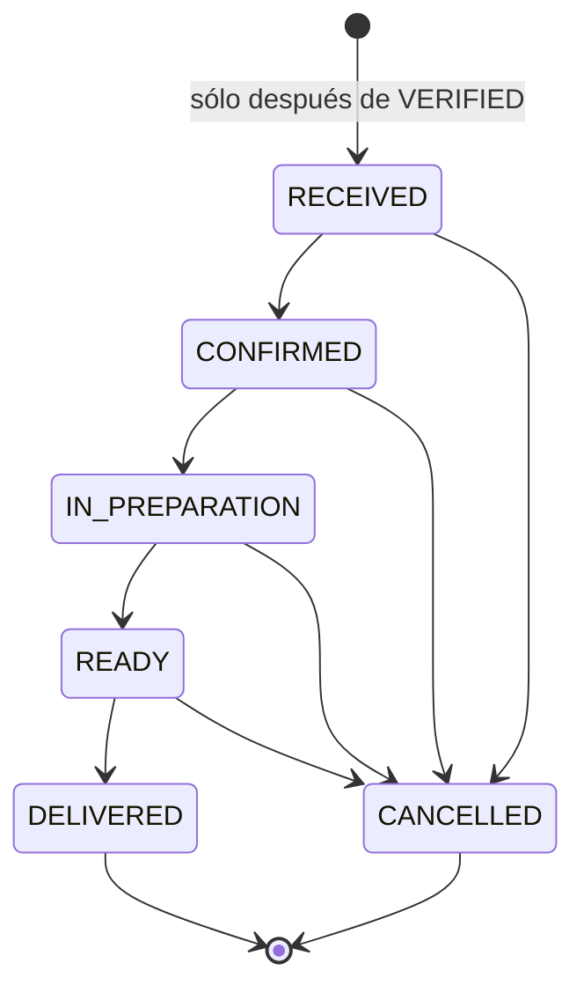
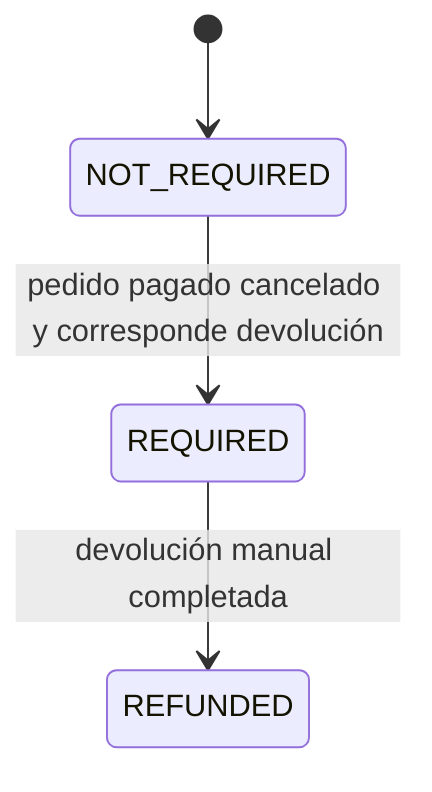
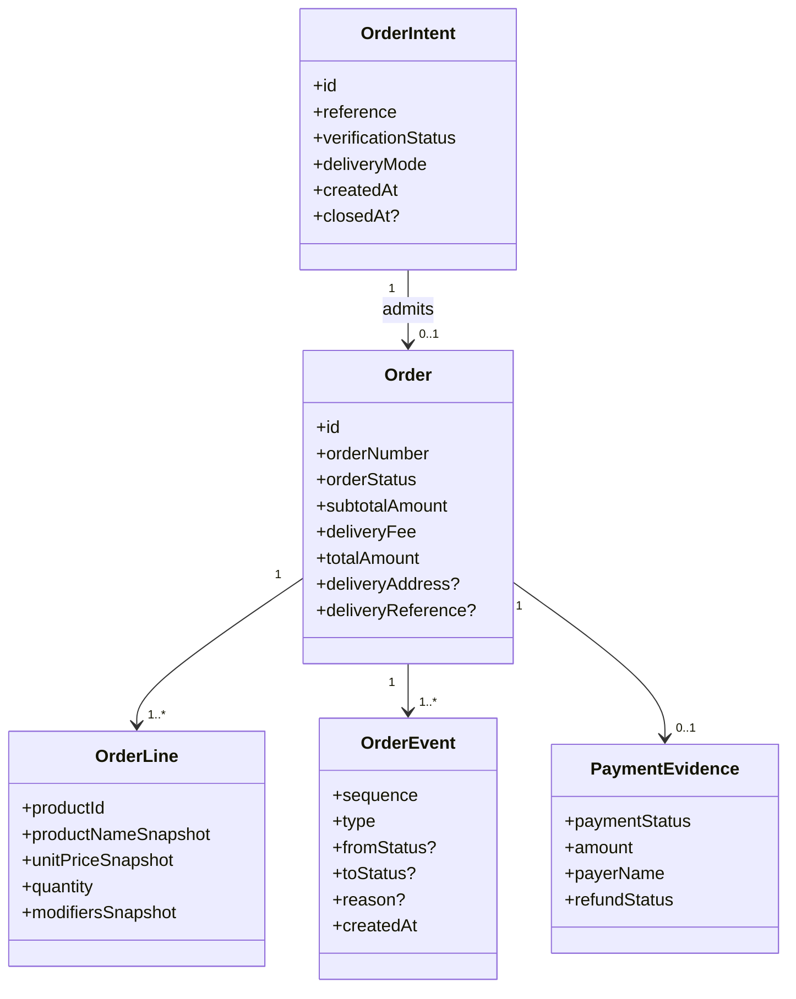
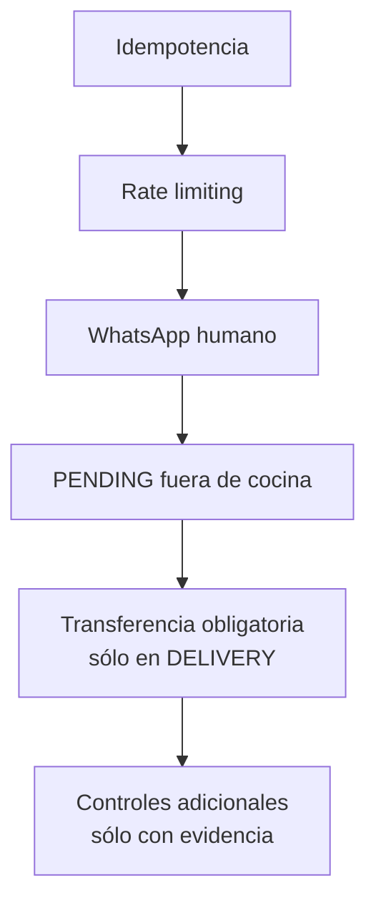
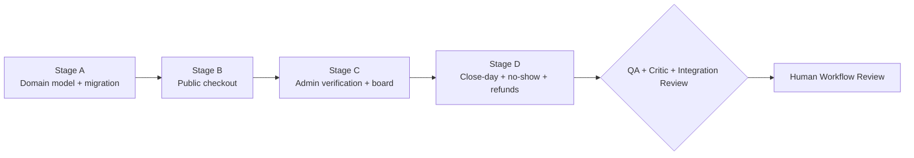

# TL-HLD-001 — Taco Loco Order Flow & Abuse-Resistance Architecture

**Artifact type:** High-Level Design (HLD)  
**Method:** FALDEO Project Method v1.0 + Project Harness Minimum v1.0  
**Status:** `HUMAN_REVIEW_CLOSED / READY_FOR_TASK_CONTRACT`  
**Environment:** staging  
**Production:** `NOT_AUTHORIZED`  
**Scope:** flujo cliente -> verificación -> operación -> entrega; delivery, pago manual, abuso, observabilidad y evolución.

---

## 1. Executive summary

Taco Loco ya demuestra el camino técnico `menu -> pedido persistido -> WhatsApp -> admin -> transiciones de estado`, pero el flujo necesita distinguir una **intención recibida** de un **pedido operativo real**.

La decisión central es separar verificación y operación:

```text
verificationStatus = PENDING | VERIFIED | EXPIRED | REJECTED
paymentStatus      = NOT_REQUIRED | PENDING | REPORTED | CONFIRMED | REJECTED
orderStatus        = RECEIVED | CONFIRMED | IN_PREPARATION | READY | DELIVERED | CANCELLED
refundStatus       = NOT_REQUIRED | REQUIRED | REFUNDED
```

Sólo pedidos verificados pueden entrar a cocina.

### Product principle

**Progressive friction:** no pedir información, validaciones ni pasos adicionales salvo que sean necesarios para completar el pedido o mitigar un riesgo demostrado.

### Operational principle

**One-action transitions:** cada decisión normal del operador debe resolverse con una sola acción principal.

---

## 2. Engineering principles

1. **Intent is not operation.** Una acción del navegador no autoriza preparación.
2. **Taco Loco/D1 es la fuente de verdad.** WhatsApp es canal de comunicación y evidencia humana.
3. **Progressive friction.** No pedir nombre, teléfono, registro, OTP o comprobantes sin necesidad real.
4. **Risk controls are progressive.** Los controles aumentan sólo cuando la evidencia lo justifica.
5. **No silent destructive transitions.** Rechazos, cancelaciones y cambios de estado quedan auditables.
6. **Operational UX is primary.** El admin debe comportarse como consola del foodtruck, no como CRUD principal.
7. **One-action transitions.** El camino feliz del operador no debe tener clicks redundantes.
8. **Evidence before complexity.** WhatsApp API, conciliación automática, scoring y antifraude avanzado quedan deferidos.
9. **Production is a separate Human Gate.** Este HLD no autoriza release productivo.

---

## 3. System context — C4-lite



### Boundary rules

- El navegador no introduce trabajo directamente en cocina.
- WhatsApp confirma intención, pero no reemplaza la base de datos.
- El operador controla la admisión operativa.
- D1 conserva snapshots, estados, pagos informados e historial.
- Producción queda fuera del alcance.

---

## 4. Baseline proven in staging

El staging ya prueba:

- menú público con 7 categorías y 31 productos canónicos;
- precios, modificadores y Static Assets;
- persistencia server-side;
- `clientReference` idempotente;
- numeración `TL-xxxx`;
- líneas y snapshots;
- estados operativos;
- `OrderEvent` y SSE replay;
- auth/session/logout admin;
- WhatsApp al número correcto;
- revisión operativa en staging.

La brecha material es que abandono, pedido falso y pedido real pueden parecer demasiado similares antes de la verificación humana.

---

## 5. Target customer flow



### Customer data policy

En v1 no se solicita nombre ni teléfono general del cliente.

DELIVERY solicita sólo:

- dirección obligatoria;
- referencia opcional;
- nombre del titular desde el que se hizo la transferencia.

No se carga comprobante.

---

## 6. Swimlane / responsibility model



---

## 7. State architecture

### Verification



No existe expiración corta de 10–15 minutos. Los pendientes permanecen fuera de cocina y se cierran al final de la jornada.

### Payment



### Operation



### Refund



La v1 no automatiza movimientos de dinero.

---

## 8. High-level information model



La implementación puede usar `OrderIntent` separado o una estructura equivalente, pero debe preservar **PENDING intent != operational order**.

Datos legacy no deben reinterpretarse ni destruirse.

---

## 9. Abuse / false-order threat model

| Threat | Impact | MVP control | Escalation |
|---|---:|---|---|
| Duplicado accidental | bajo | idempotencia | ninguna |
| Abandono normal | bajo | PENDING fuera de cocina + cierre de jornada | UX tuning |
| Pedido en joda | medio | WhatsApp antes de cocina | revisar métricas |
| Spam automatizado | medio/alto | rate limit + pendientes fuera de operación | control distribuido si se prueba necesidad |
| No-show RETIRO | medio/alto | motivo `NO_SHOW` por pedido | reevaluar sólo con evidencia |
| Delivery falso | alto | transferencia obligatoria + verificación manual | automatización futura si escala |

### Identity limitation

Sin nombre/teléfono/identidad no puede detectarse de forma fiable una reincidencia individual. En v1 esto se acepta deliberadamente para evitar fricción. `NO_SHOW` se registra por pedido, no por persona.

---

## 10. Defense-in-depth



No CAPTCHA, OTP, registro, login de cliente, teléfono obligatorio ni scoring en el camino normal.

---

## 11. Operational console


### RETIRO card

Debe mostrar:

- `TL-xxxx`;
- edad;
- productos/modificadores;
- total;
- acción primaria **CONFIRMAR PEDIDO**.

### DELIVERY card

Además:

- dirección;
- referencia;
- costo de envío;
- total final;
- titular informado;
- acción primaria **CONFIRMAR PAGO Y PEDIDO**.

`Pago no encontrado`, rechazo, cancelación y devolución son excepciones, no parte del camino feliz.

---

## 12. Delivery and payment policy

Para RETIRO:

```text
paymentStatus = NOT_REQUIRED
```

Para DELIVERY:

```text
PENDING -> REPORTED -> CONFIRMED
```

Reglas:

- tarifa de delivery única y configurable desde admin/settings;
- importe comercial concreto es configuración operativa, no decisión de arquitectura;
- transferencia obligatoria antes de aprobar DELIVERY;
- titular informado llega a WhatsApp y admin;
- el dueño verifica manualmente que la transferencia impactó;
- no se carga comprobante;
- no hay integración bancaria en v1.

---

## 13. Exception flows

| Scenario | Expected behavior |
|---|---|
| Negocio cerrado | no admitir pedidos operativos |
| Producto deja de estar disponible | revalidar antes de persistir |
| WhatsApp no abre | mantener PENDING y ofrecer fallback |
| TL llega después del cierre de jornada | reactivación manual sólo si el negocio decide aceptarlo |
| Cambio sobre pedido confirmado | mutación explícita + evento |
| Cliente cancela | `CANCELLED` + motivo + evento |
| Cliente no retira | `NO_SHOW` + evento |
| Intento sospechoso | `REJECTED` + motivo; nunca cocina |
| Delivery pagado cancelado | `REFUND_REQUIRED`; devolución manual; luego `REFUNDED` |

La política comercial sobre **cuándo corresponde devolver** queda fuera del HLD; la arquitectura sólo garantiza trazabilidad.

---

## 14. Metrics and observability

| Metric | Purpose |
|---|---|
| intents created | funnel |
| verified / expired / rejected | calidad de intención |
| intent -> verified | fricción de confirmación |
| confirmed -> ready | tiempo de cocina |
| ready -> delivered | demora de retiro/entrega |
| cancelaciones por motivo | pérdidas operativas |
| no-show rate | señal de riesgo |
| delivery payment rejection rate | fricción/errores de pago |
| refund required / refunded | obligaciones pendientes |
| intervención manual | oportunidad de automatización |

---

## 15. Decision register

| ID | Decision | Status |
|---|---|---|
| D-001 | Separar verificación y operación | **APPROVED** |
| D-002 | Verificación manual por WhatsApp para v1 | **APPROVED** |
| D-003 | No pedir nombre ni teléfono general | **APPROVED** |
| D-004 | PENDING fuera de cocina hasta confirmación/cierre | **APPROVED** |
| D-005 | Sin timeout corto; cierre al final de jornada | **APPROVED** |
| D-006 | DELIVERY requiere transferencia; RETIRO no | **APPROVED** |
| D-007 | Admin como consola con one-action transitions | **APPROVED** |
| D-008 | TL-xxxx al enviar el pedido | **APPROVED** |
| D-009 | NO_SHOW por pedido, sin penalización/identidad automática | **APPROVED** |
| D-010 | WhatsApp API/webhooks | **DEFERRED** |
| D-011 | Refund tracking manual para delivery pagado cancelado | **APPROVED** |

---

## 16. Delivery roadmap and gates



Implementation contract: `docs/contracts/TL-TC-ORDER-FLOW-01.md`.

---

## 17. Acceptance criteria for implementation

La futura implementación no queda completa hasta probar en staging:

- PENDING nunca entra a cocina;
- RETIRO funciona sin identidad/pago obligatorio;
- DELIVERY exige pago confirmado;
- `TL-xxxx` correlaciona sistema y WhatsApp;
- titular de transferencia aparece en WhatsApp y admin;
- tarifa fija proviene de settings;
- DELIVERY se aprueba con una sola acción;
- cierre de jornada cierra PENDING sin afectar confirmados;
- NO_SHOW queda auditado;
- refund tracking funciona sin automatización bancaria;
- idempotencia, eventos/SSE, catálogo, auth y assets no regresan;
- producción sigue bloqueada.

---

## 18. Human Review closure

El Human Review queda cerrado con estas decisiones:

- `TL-xxxx` al enviar pedido;
- sin nombre ni teléfono general;
- RETIRO: WhatsApp + aprobación manual;
- DELIVERY: dirección mínima + referencia opcional + tarifa fija + transferencia + titular;
- titular y `TL-xxxx` visibles en WhatsApp y admin;
- PENDING fuera de cocina;
- cierre de pendientes al final de jornada;
- NO_SHOW sólo como evidencia por pedido;
- admin con una acción primaria por transición;
- refund tracking manual cuando corresponda.

Inputs de negocio pendientes para la **validación manual final**, no para la arquitectura:

1. importe inicial de delivery en settings de staging;
2. validar con el dueño que la tarjeta operativa contiene suficiente información de un vistazo.

---

## 19. Authorization boundary

Este HLD cierra diseño y habilita la creación/ejecución del Task Contract **sólo en staging**.

No autoriza:

- producción;
- cutover productivo;
- integración bancaria;
- WhatsApp Business API;
- identidad adicional del cliente;
- infraestructura nueva fuera del contrato.

**Producción permanece `NOT_AUTHORIZED`.**